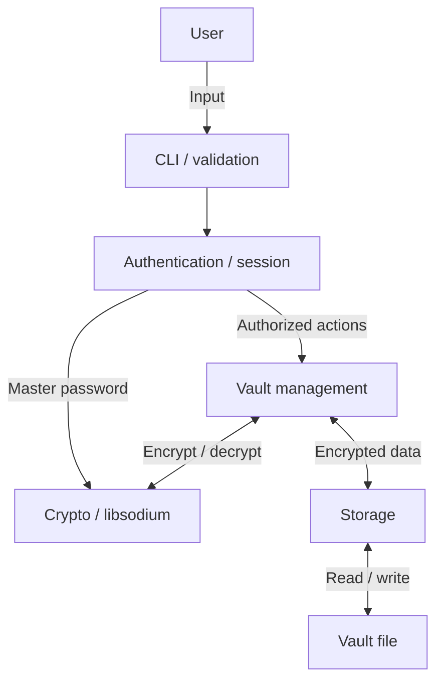

# Architecture

## Status

Architecture for Checkpoint 1.
The application is not implemented yet.

## Overview

A single-user password manager for Linux, written in C language.
The user unlock an encrypted vault with master password
and manage credentials through a CLI.

## Components and data flow

### CLI and input validation

Commands and interactive input with length restrictions.
Dont display passwords in plain text, and dont type confidential data in the command line.

### Authentication and session control

Ensure that the “locked” and “unlocked” states are maintained.
Allow data modification only when the storage is unlocked.
Locking or logging out clears the session and any confidential data.

Only one user.
The owner of the unlocked storage is the only user of the application.

### Vault management

Management of user names and passwords.
Support for adding, viewing the list, retrieving, updating, and deleting records.
Verification of the structure of a decrypted record before it is used.

### Cryptography

Use libsodium.

Proposed scheme:

- Argon2id generates a key based on a master password and a random value.
- XChaCha20-Poly1305 provides encryption and authentication for the storage contents.
- A new nonce is used for each encryption operation.
- The exposed header is authenticated as associated data.
- Unlocking occurs only after successful authenticated decryption.

The master password and encryption key are never stored in disk.
In this implementation,
successful authenticated decryption is used to verify the generated key; a separate password verification mechanism is not used. 

### Storage

Store the vault in the private directory of the current user.
Restricted access rights and secure file-opening procedures.

## Proposed vault format

A versioned binary file containing:

1. Format identifier and version.
2. Argon2id salt and resource parameters.
3. Encryption nonce.
4. Encrypted records and authentication tag.

The header contains no plaintext credentials.
Header fields, file size and resource parameters must be bounded
and validated before key derivation or memory allocation.

Exact field sizes, record encoding and limits will be specified
before implementing the file parser.

## Memory and session lifecycle

1. Read the master password without terminal echo.
2. Read and validate the vault header.
3. Derive the encryption key.
4. Clear the master-password buffer.
5. Authenticate and decrypt the vault.
6. Validate the records and enter the unlocked state.
7. Clear sensitive buffers when locking, exiting or handling errors.

A failed unlock must leave the application locked.

## Trust boundaries

- Terminal input is untrusted.
- Disk files and header fields are untrusted.
- Credentials become usable only after successful authentication
  and record validation.
- The operating system and libsodium are trusted dependencies.

## Logging

Record key events such as unlock attempts, vault changes and failures.
Use structured events with timestamps and outcomes.
Do not log master passwords, keys, stored credentials or raw user input.

