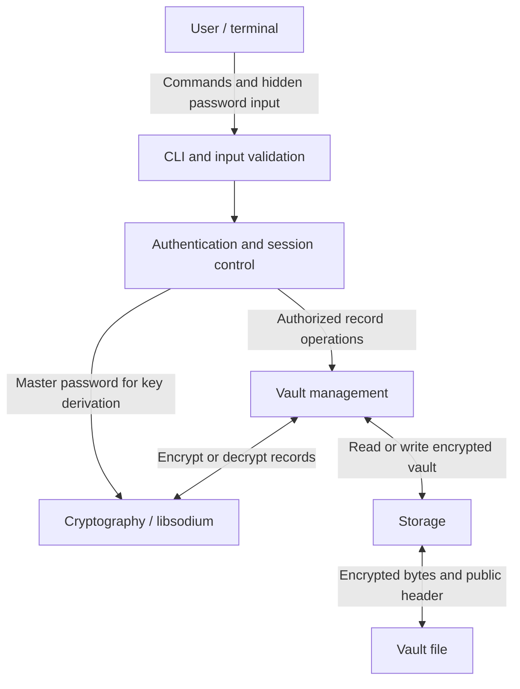

# Architecture

## Status

Initial architecture for Checkpoint 1.
The application is not implemented yet.

## Overview

A local, single-user password manager for Linux, written in C.
The user unlocks an encrypted vault with a master password
and manages credentials through a command-line interface.

## Components and data flow

### CLI and input validation

Accept commands and interactive input with explicit length limits.
Never print plaintext passwords or include secrets in command-line
arguments. The credential retrieval mechanism is pending clarification.

### Authentication and session control

Maintain locked and unlocked states.
Allow record operations only while the vault is unlocked.
Locking or exiting clears the session and sensitive buffers.

There are no separate application accounts.
The unlocked vault owner is the application's single user.

### Vault management

Manage service names, usernames and passwords.
Support adding, listing, retrieving, updating and deleting records.
Validate decrypted record structure before using it.

### Cryptography

Use libsodium rather than implementing cryptographic algorithms.

Proposed scheme:

- Argon2id derives a key from the master password and a random salt.
- XChaCha20-Poly1305 encrypts and authenticates the vault contents.
- Each encryption uses a fresh random nonce.
- The public header is authenticated as associated data.
- Unlocking succeeds only after authenticated decryption succeeds.

The master password and encryption key are never saved to disk.
This proposal uses successful authenticated decryption to verify
the derived key; it does not store a separate password verifier.
Alignment with the assignment's password-hashing requirement
will be confirmed before implementation.

### Storage

Store the vault in a private directory owned by the current Linux user.
Use restrictive permissions and safe file-opening procedures.
Save changes through a securely created temporary file and atomic
replacement, with write errors handled before reporting success.

## Proposed vault format

A versioned binary file containing:

1. Format identifier and version.
2. Argon2id salt and resource parameters.
3. Encryption nonce.
4. Encrypted records and authentication tag.

The header contains no plaintext credentials.
Header fields, file size and resource parameters must be bounded
and validated before key derivation or memory allocation.

Exact field sizes, record encoding and limits will be specified
before implementing the file parser.

## Memory and session lifecycle

1. Read the master password without terminal echo.
2. Read and validate the vault header.
3. Derive the encryption key.
4. Clear the master-password buffer.
5. Authenticate and decrypt the vault.
6. Validate the records and enter the unlocked state.
7. Keep the key and decrypted records only while needed
   during the unlocked session.
8. Clear sensitive buffers when locking, exiting or handling errors.

A failed unlock must leave the application locked.

## Trust boundaries

- Terminal input is untrusted.
- Disk files and header fields are untrusted.
- Credentials become usable only after successful authentication
  and record validation.
- The operating system and libsodium are trusted dependencies.

## Logging

Record key events such as unlock attempts, vault changes and failures.
Use structured events with timestamps and outcomes.
Do not log master passwords, keys, stored credentials or raw user input.

## Pending decisions

- Lecturer-approved credential retrieval mechanism.
- Final vault encoding and resource limits.
- Confirmation of the proposed master-password verification design.
